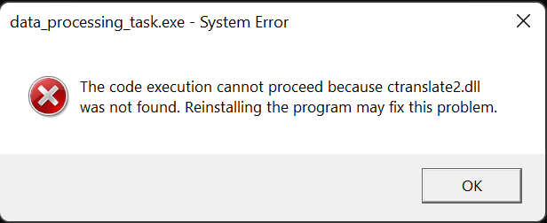

# Data Processing Task - 01

Hi, welcome to this quick one hour task, this is the
first step in our collaboration and fun. If you complete this
you will unlock further tasks with a much higher prize. This
is also the first step to getting familiar with our new code base.
Are you up for the challenge

- Read: 10min
- Explore: 20min
- Solution: <30min

Here are a few rules:
- Templates not allowed!!!
- the outcome of the cpp code must be the same as in python that means the whisper inference section should return the same result.
Only then will it be considered completed. You can get the model [here](https://drive.google.com/file/d/1LRuLd0XeNXsz609KP1ZxhqMd5_6dj9KC/view?usp=sharing)
- It must be compilable by clang or similar compilers (you cannot use an interpreter)
- You must have an Intel CPU for this that supports mkl-intel, or if not you can try doing it on amd though the setup wouldn't be exactly the same

## What to do?

In this simple task you will need to convert a matrix from
`std::vector<std::vector<float>>` into our custom type of
`ctranslate2::StorageView` you can find its definition
[here](https://github.com/OpenNMT/CTranslate2/blob/5f9aac6d3cf240a2f47dcc663f608bb445d41218/src/storage_view.cc)
:) Feel free to look at it see how it works you will not use most
of the functions of the type since you will just need to init 
it correctly.

### python example

We have created an example in python to show that everything is
working well. You can find and run in main.py.

### script intro
We have created a function in DataProcessingTask.cpp as follows: 
```cpp
ctranslate2::StorageView get_ctranslate2_storage(std::vector<std::vector<float>>& segment)
{
    auto device = ctranslate2::Device::CPU;
    auto dtype = ctranslate2::DataType::FLOAT32;

    // put your code here

    ctranslate2::StorageView view(dtype, device);

    // put your code here

    return view;
}
```
Your goal is to fill in this function similar to how it's done in
the python example.

Keep in mind you can go outside the function if needed. 

## setup

We have used Visual Studio and cmake for this but feel free
to go any other route, we don't have any external deps, 
everything is included. Just run the setup.bat script and
everything will be setup for you. Then open it in 
as a folder in Visual Studio, and it should be good to go.
Also make sure to install the [MKL-intel lib](https://www.intel.com/content/www/us/en/developer/tools/oneapi/onemkl-download.html)
if you don't have it already. If you get any MKL related
issues then feel free to manually replace the path wherever
it's needed.
___
For python just pip install ctranslate2 and numpy.

If you get the following error: 
then just go into `out\build\x64-debug\CTranslate2`
and coppy over `ctranslate2.dll` into `out\build\x64-debug`
same for release.

Also Replace the paths through out the project with your own!

---
Good luck:)
